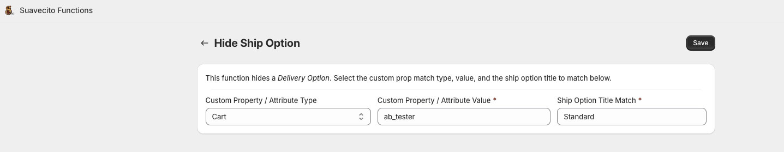
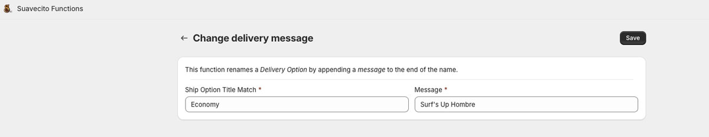
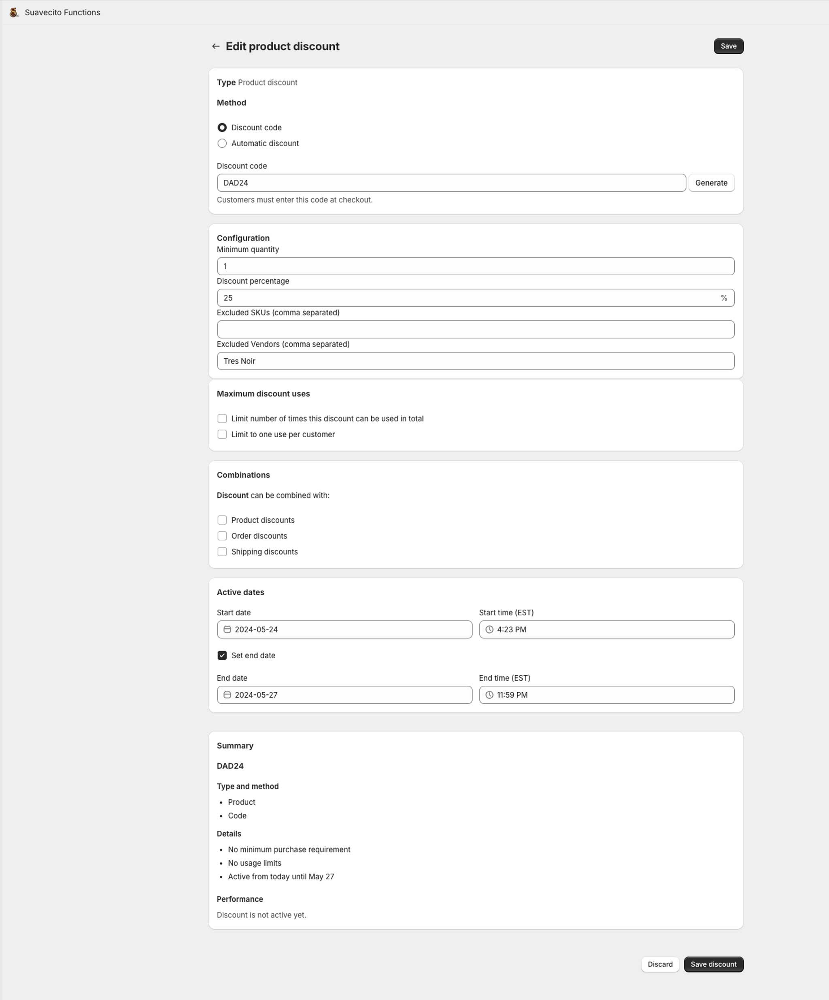
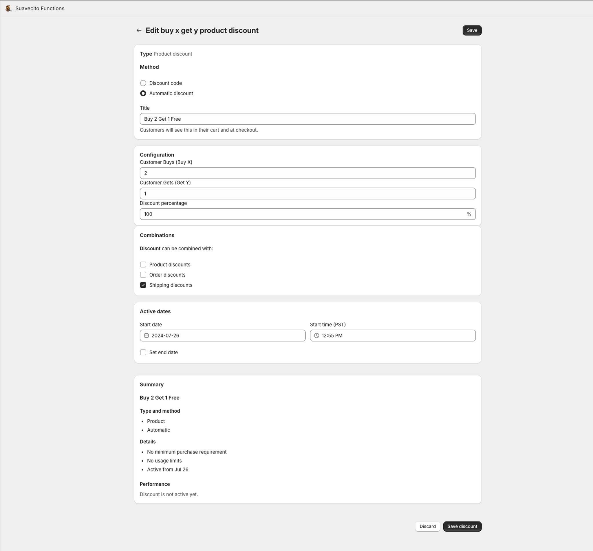
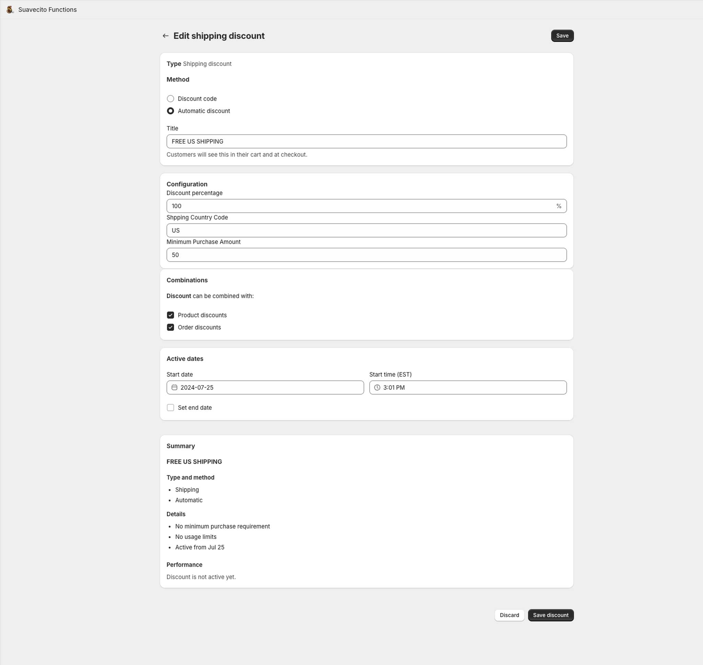
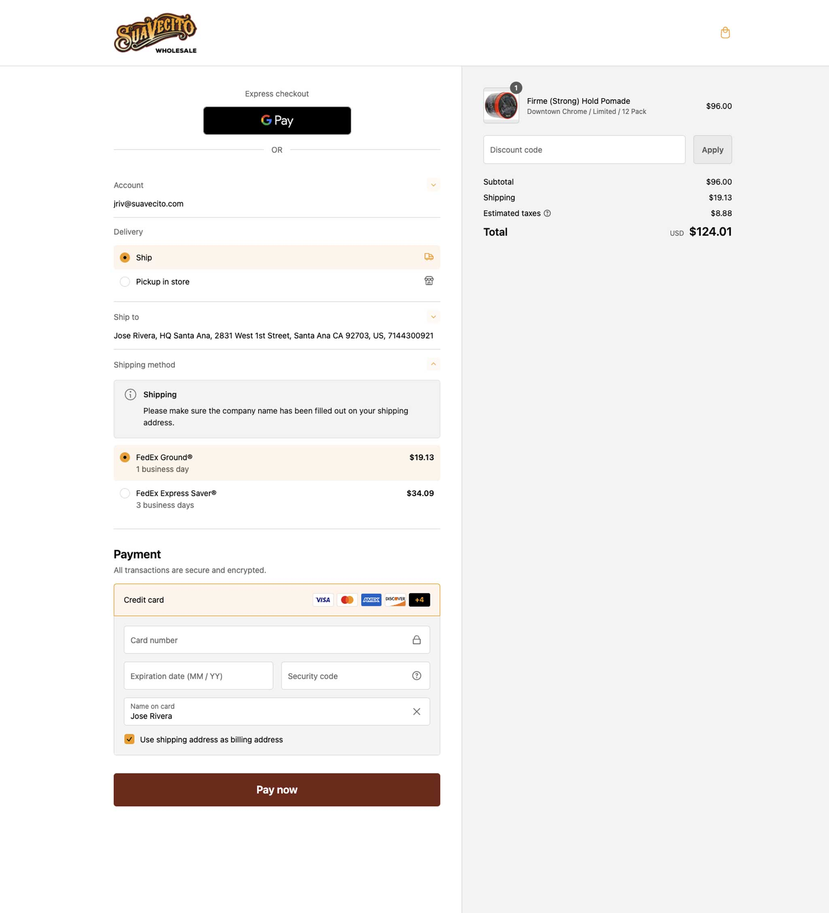

# Shopify Functions

> Shopify Functions allow developers to customize the backend logic of Shopify.

<p align="center">
  
</p>

[Shopify Functions Overview](https://shopify.dev/docs/apps/functions)

## Dev

```bash
shopify app dev
```

## Deploy / Re-Deploy

```bash
shopify app deploy
```

## Generate New Delivery Customization Extension

```bash
shopify app generate extension --template delivery_customization --name delivery-customization
```

## Deployment Environmental Variables

```bash
SHOPIFY_API_KEY=
SHOPIFY_API_SECRET=
SHOPIFY_APP_URL=https://functions.suavecito.com
SCOPES=write_delivery_customizations,write_products,write_content
```

## Functions

<p align="center">
  
</p>

### Delivery Customization

> You can use delivery customizations to hide, reorder, and rename the delivery options that are available to buyers during checkout.

Delivery Option Hide

- This function hides a `delivery option`.
- Set the custom property (cart attribute or line item property) and value to match against
- Set the Ship Option Title / Name to match against

<p align="center">
  
</p>

Delivery Option Rename

- This function renames a `delivery option` by appending a message to the end of the title
- Set the custom property (cart attribute or line item property) and value to match against
- Set the Ship Option Title / Name to match against

<p align="center">
  
</p>

### Product Discounts

> The Product Discount API enables you to create a new type of discount that is applied to a particular product or product variant in the cart.

Product Discount (Percent Off)

- This function creates a product variant discount the discount is limited to a percentage of the original price
- Product variants can be excluded by sku and or vendor
- To exclude a product variant from all discounts created by this app, simply set the Suavecito Function - Exclude from all discounts metafield to true

<p align="center">
  
</p>

Buy X Get Y Product Discount (Percent Off)

- This function creates a simple (really basic) Buy X Get Y product discount
- The function takes 3 arguments: Buy X (number of products), Get Y (number of products), and Percentage (discount percentage)
- The function will handle the rest of the logic. Including the discount split. Eligible products depend on a variant metafield: `variant.metafields.debut.enable_b2g1f` \*\* metafield namespace and key could change
  - Ex: Buy 2 Get 1 Free. Input = 5 eligible products, Discount Split = 4 Paid, 1 Free.
  - Ex: Buy 2 Get 1 Free. Input = 6 eligible products, Discount Split = 4 Paid, 2 Free.

<p align="center">
  
</p>

### Shipping Discounts

> The Shipping Discount API enables you to create a new type of discount that's applied to one or more shipping rates at checkout.

Shipping Discount

- This function creates a shipping discount, the discount is limited to a percentage of the original shipping price
- The function takes 3 arguments: discount percentage, shipping country code and minimum purchase amount
- If the requirements are met (shipping country & min purchase amount), the function will select the cheapest priced shipping option from the currently available options, and it will discount it by the selected discount percentage
- Example use case: Free US Shipping Over $50.

<p align="center">
  
</p>

### Checkout Ui Extensions

> Checkout UI extensions let app developers build custom functionality that merchants can install at defined points in the checkout flow, including product information, shipping, payment, order summary, and Shop Pay.

### Checkout Banner

- A custom banner is a notice that you can display to customers. For example, you might want to show a banner that indicates that items are final sale and can't be returned or exchanged.
- 2 banner targets were added, one above the line items and one in the shipping section.

<p align="center">
  
</p>
