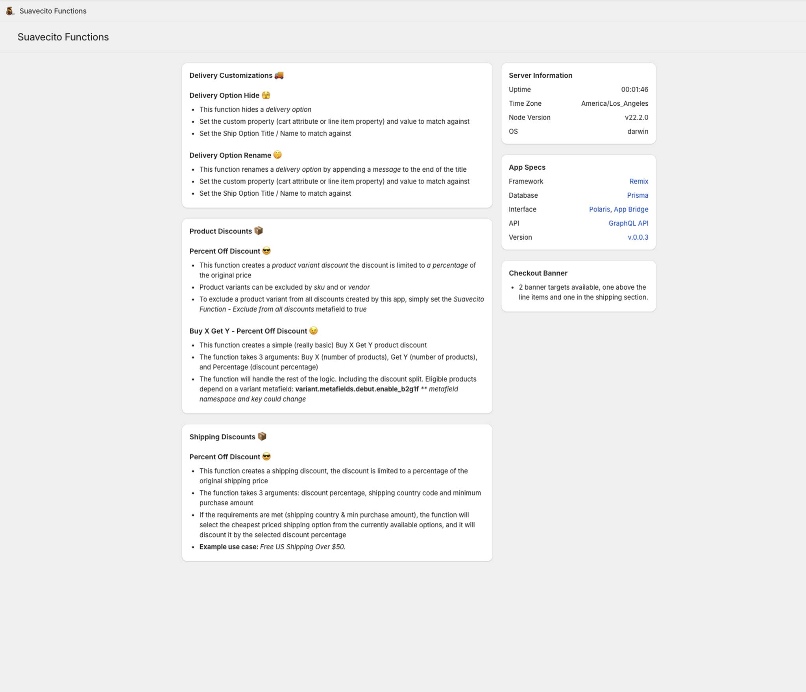

# Shopify Functions

> Shopify Functions allow developers to customize the backend logic of Shopify.

<p align="center">
  
</p>

[Shopify Functions Overview](https://shopify.dev/docs/apps/functions)

## Dev

```bash
shopify app dev
```

## Deploy / Re-Deploy

```bash
shopify app deploy
```

## Generate New Delivery Customization Extension

```bash
shopify app generate extension --template delivery_customization --name delivery-customization
```

## Functions

<p align="center">
  
</p>

### Shopify Delivery Customization

> You can use delivery customizations to hide, reorder, and rename the delivery options that are available to buyers during checkout.

Delivery Option Hide

- This function hides a `delivery option`.
- Set the custom property (cart attribute or line item property) and value to match against
- Set the Ship Option Title / Name to match against

<p align="center">
  
</p>

Delivery Option Rename

- This function renames a `delivery option` by appending a message to the end of the title
- Set the custom property (cart attribute or line item property) and value to match against
- Set the Ship Option Title / Name to match against

<p align="center">
  

</p>
